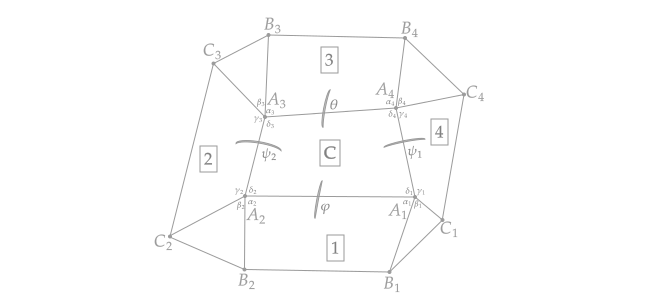

# Flexible Quadrilateral Mesh Generator (3x3 Case)

<p align="center">
  
</p>

<p align="center"><strong>Figure 1: Example of 3x3 mesh.</strong></p>


A robust Python toolset for generating flexible quadrilateral meshes of equimodular elliptic type. This project is dedicated to solving optimization problems related to mesh generation and transformation, ensuring the creation of valid and non-self-intersecting quadrilateral meshes. The tools are designed to support complex mathematical computations, such as calculating normals, angles, and optimizing for specific mesh properties.

## Table of Contents
- [Overview](#overview)
- [Key Features](#key-features)
- [Installation](#installation)
- [Usage](#usage)
  - [Step 1: Normals Generation](#step-1-normals-generation)
  - [Step 2: Sample Angles Calculation](#step-2-sample-angles-calculation)
  - [Step 3: Optimal Solution](#step-3-optimal-solution)
  - [Step 4: Optimal Angle Calculation](#step-4-optimal-angle-calculation)
  - [Step 5: t-Values Calculation and Double Check](#step-5-t-values-calculation-and-double-check)
  - [Step 6: Transforming Angles to Mesh Vertices](#step-6-transforming-angles-to-mesh-vertices)
- [Acknowledgments](#acknowledgments)
- [License](#license)

## Overview
This project solves the problem of generating flexible quadrilateral meshes of equimodular elliptic type by utilizing complex mathematical models and optimization techniques. The workflow is divided into several key steps: generating the normals for mesh faces, calculating sample angles, solving optimization problems, validating results through t-values, and transforming angles into vertices for 3D visualization.

The core of the project lies in transforming given angles and constraints into a flexible mesh structure with specific properties (non-self-intersecting, equal moduli at common vertices, etc.). It ensures the quadrilateral mesh generated meets the required geometric conditions.

## Key Features
- **Polynomial System Generation:** Ability to generate 4 and 9 polynomial equations for mesh flexibility based on the given deltas and dihedral angles.
- **Optimization Solver:** Uses the Sequential Least SQuares Programming (SLSQP) method to solve minimization problems.
- **t-Values Computation:** Ensures that the quadrilateral mesh satisfies the periodicity conditions.
- **3D Mesh Visualization:** Transform computed angles into mesh vertices, outputting 3D OBJ files for external visualization.
- **Handles Self-intersections:** Avoids mesh self-intersections during vertex calculation.

## Installation
1. Clone the repository:

   ```bash
   git clone https://github.com/nurmaton/Flexible-Quadrilateral-Mesh-Generator.git
   cd Flexible-Quadrilateral-Mesh-Generator
   ```

## License

This project is licensed under the Apache License 2.0. See the [LICENSE](./LICENSE) file for more details.

